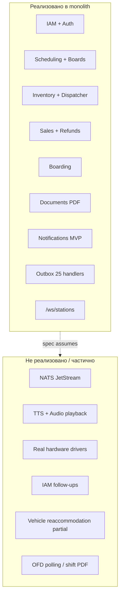

# Анализ backend Transora — что не реализовано

> Аудит модульного монолита (`backend/app`) относительно доменных спек `docs/transora-*-service.md`.  
> Каталог реализованного API: [backend-api-catalog.md](backend-api-catalog.md).

## Точка отсчёта: что уже есть

Модульный монолит `backend/app` + domain-модули (`iam`, `scheduling`, `inventory`, `sales`, `boarding`, `documents`, `notifications`, `admin`). **67 integration-тестов**, Flyway **V1–V21**, OpenAPI/Scalar, docker-compose.

**Рабочий vertical slice:**

- Auth (JWT RS256, refresh, Redis lockout/blacklist)
- Scheduling (trips, routes, schedules, stops, generation job, boards REST+WS)
- Inventory (reservations, segments, transit gates, seat blocks, sales restrictions)
- Sales (orders saga, shifts, tickets, refunds, tariffs)
- Boarding (scan, sync, manifest, stats)
- Documents (ticket/manifest/boarding sheet/carrier report PDF)
- Notifications MVP (announcement queue CRUD, board refresh)
- Station-agent core WS (`/ws/stations`, sync, trip events, `ticket.used`)
- Admin (reports, audit, tariffs, refund policies)



---

## 1. Платформа и инфраструктура

| Пробел | Спека | Статус |
|--------|-------|--------|
| NATS JetStream | Все `transora-*-service.md` | **Нет.** Только in-process outbox. `NatsSchedulingEventBridge.kt` — пустой interface |
| Kong / API Gateway | [transora-deployment.md](transora-deployment.md) | **Нет** (ожидаемо для MVP) |
| MinIO/S3 для документов | [transora-document-service.md](transora-document-service.md) | **Нет.** Local filesystem |
| Prometheus/Grafana/Loki | deployment §10 | **Нет** (только Actuator health) |
| K8s/HA Postgres/Redis Sentinel | deployment | **Нет.** docker-compose: Postgres + Redis + backend |

---

## 2. IAM ([transora-iam-service.md](transora-iam-service.md))

| Пробел | Статус |
|--------|--------|
| Service tokens API (`POST/DELETE /service-tokens`, BR-IAM-023) | **Реализовано.** `/api/admin/service-tokens` CRUD + Bearer `st_*` auth filter |
| Deactivate/activate user, change password | **Реализовано.** Admin endpoints + refresh revoke on deactivate (BR-IAM-004) |
| Remove assignment (`DELETE .../assignments/{id}`) | **Реализовано.** Station scope guard |
| Custom roles (`POST /roles`, BR-IAM-010) | **Нет.** Только system roles |
| Block SERVICE accounts from password login (BR-IAM-005) | **Реализовано.** Login 403 for `UserType.SERVICE` |
| Deactivate → invalidate all tokens (BR-IAM-004) | **Реализовано.** Refresh revoke + JWT filter `isActive` reload |
| IAM NATS events | **Нет** |
| Self-service change password (`PUT /users/{id}` profile edit) | **Нет** |

**Есть:** login/refresh/logout/me/jwks, RBAC + station scope, admin users CRUD (deactivate/activate/change-password/assignment revoke), service tokens + Bearer auth, Redis lockout + blacklist.

---

## 3. Scheduling ([transora-scheduling-service.md](transora-scheduling-service.md))

| Пробел | Статус |
|--------|--------|
| **Vehicle change → reaccommodation** (BR-SCH-024, BR-INV-003) | **Реализовано (partial).** `TripInventoryService.reaccommodateForTrip` сохраняет sold seats и `seat_sales`; overflow → `requires_reaccommodation`, outbox `inventory.reaccommodation.required`, статус `REACCOMMODATING`. Без skip при идентичной схеме мест |
| Trip cancel + mass refund/rebooking (BR-SCH-025) | **Частично.** Cancel блокируется при issued tickets; workflow возврата/пересадки нет |
| Schedule deactivation при активных продажах (BR-SCH-015) | **Слабо** — guard на route есть, на schedule-level неполный |
| External NATS consumers | **Нет** |

**Есть:** routes/schedules/stops, trip generation job, conflict checks, board REST/WS, station-agent trip push.

---

## 4. Inventory ([transora-inventory-service.md](transora-inventory-service.md))

| Пробел | Статус |
|--------|--------|
| Sales restriction на `schedule_entry` (BR-INV-022–023) | **Реализовано (partial).** `POST /api/sales-restrictions` с `scheduleEntryId`; trip-level rule имеет приоритет (V20) |
| Pause/resume restriction (BR-INV-024) | **Реализовано.** `POST /api/sales-restrictions/{id}/pause|resume` |
| Release seat block (BR-INV-032) | **Реализовано.** `POST /api/seat-blocks/{id}/release`; creator или superuser (V20) |
| Session disconnect → release reservations (BR-INV-013) | **Нет** |
| Shift close → auto-release reservations (BR-SAL-053) | **Инвертировано** — close **отклоняется** при active reservations |
| Redis TTL для reservations (BR-INV-011) | **Частично** — DB + sweeper, без Redis layer |

**Есть:** reservations, segment overlap, transit gates, station seat map, TTL sweeper.

---

## 5. Sales ([transora-sales-service.md](transora-sales-service.md))

| Пробел | Статус |
|--------|--------|
| **Два несовместимых пути продажи** | **Реализовано.** `POST /api/tickets` и `POST /api/orders` используют общий `TicketSaleOrchestrator` (payment, fiscal, docs, order record). BR-SAL-008: при fiscal fail reservation остаётся ACTIVE |
| Card payments / terminal (BR-SAL-023) | **Нет.** Mock transaction id |
| Persisted fiscal receipts / OFD status | **Частично.** SALE/REFUND/Z_REPORT пишутся в `sales.fiscal_receipts` (V19); OFD polling и lifecycle ФН — нет |
| Z-report on shift close (BR-SAL-052) | **Реализовано (partial).** `ShiftClosedHandler` на `shift.closed` → mock `printZReport` + запись Z_REPORT; shift PDF report — нет |
| Refund after actual departure at stop (BR-SAL-021) | **Частично** — trip `departureTime`, не stop `actual_departure` |
| Carrier-scoped tariffs/policies (BR-SAL-030–040) | **Частично** — route+segment only |

**Есть:** shifts, orders, refunds с penalty tiers, tariff/refund admin CRUD.

---

## 6. Documents ([transora-document-service.md](transora-document-service.md))

| Пробел | Статус |
|--------|--------|
| JasperReports / template management | **Нет.** OpenPDF text-only |
| Boarding sheet Code 128 barcodes (BR-DOC-021) | **Done** — Code 128 с `ticket_id` в PDF-таблице |
| 80mm thermal ticket (BR-DOC-032) | **Done** — OpenPDF 80×150mm, компактная вёрстка |
| QR с checksum (BR-DOC-031) | **Done** — JSON + CRC32 (`TicketQrPayload`) |
| Shift report on `shift.closed` | **Нет** |
| `print_log` / reprint audit (BR-DOC-034) | **Done** — запись при GET `/api/tickets/{id}/document` |
| 90-day retention (BR-DOC-003) | **Нет** |
| Manifest filter ISSUED+USED (BR-DOC-011) | **Done** — `listActiveByTripId`, hash по id+status |

**Есть:** ticket PDF (thermal), void watermark «АННУЛИРОВАН», manifest/boarding sheet/carrier report via outbox, print_log audit.

---

## 7. Notifications ([transora-notification-service.md](transora-notification-service.md))

Спека описывает **отдельный Go-сервис**; в monolith — Kotlin MVP.

| Пробел | Статус |
|--------|--------|
| TTS (Yandex/RHVoice), audio cache, MinIO | **Частично** — mock TTS + file cache (`MockTtsService`, WAV в `transora.notifications.storage-path`) |
| Playback → station-agent (WS `audio.play`) | **Done** — `StationAgentEventPublisher.playAudio`, Go `playback.Agent` |
| Scheduled auto-announcements (−30/−15 min, arrival) | **Частично** — job `DEPARTURE_30` / `DEPARTURE_15`; arrival — follow-up |
| Announcement templates | **Done** — V22 `announcement_templates`, seed + GET `/api/announcements/templates` |
| Queue semantics (priority, pause, caps, ad cap) | **Частично** — priority + `queue_paused` per station; caps/ad cap — follow-up |
| Display board registration API | **Done** — `POST /api/display-boards/register`, heartbeat |

**Есть:** board REST/WS, announcement CRUD, auto-enqueue on events, board refresh coordinator, mock TTS playback pipeline.

---

## 8. Boarding + Station Agent (core-side)

| Пробел | Статус |
|--------|--------|
| `ticket.issued` / `sales.ticket.refunded` WS push | **Done** — outbox → departure-station agent (`ticket.issued`, `ticket.refunded`) |
| Periodic `ping` from core | **Done** — `StationAgentPingJob` every 30s (configurable) |
| `sync.force` trigger (admin/API) | **Done** — `POST /api/stations/{stationId}/agent/sync-force` |
| Audio commands over WS | **Done** — `audio.play` + `audio.stop` on queue pause |

**Есть (core):** scan, sync, manifest, stats, `ticket.used` / `ticket.issued` / `ticket.refunded` push.

**Go `station-agent/`** (отдельный процесс): skeleton + Phase 2–3 + ticket cache WS updates + PlaybackAgent; **нет** Prometheus, Windows service.

---

## 9. Hardware Agent

| Пробел | Статус |
|--------|--------|
| Go chi server с ATOL/Shtrih/Ingenico/ESC-POS | **Нет.** `hardware-agent/` — Spring mock stub |
| Payment terminal, fiscal shift, device health SSE | **Частично** — fiscal receipt/refund/Z-report + open fiscal shift on `shift.opened` (V21) |
| Fiscal shift ↔ cashier shift lifecycle | **Частично** — `fiscal_shift_no` stored on shift open via outbox handler |

---

## 10. Outbox

**25 handler'ов** в [`OutboxHandlers.kt`](../backend/app/src/main/kotlin/ru/transora/app/outbox/handlers/OutboxHandlers.kt) — incl. P1 #6:

| Event | Side effect |
|-------|-------------|
| `shift.opened` | Open fiscal shift on KKT (mock), store `fiscal_shift_no`, audit |
| `sales.order.completed` | Audit `order_completed` |
| `scheduling.schedule.updated` | Trip regeneration for route |
| `reservation.created/released/expired` | Audit + board refresh (except `confirmed`) |
| `reservation.confirmed` | Audit only |
| `inventory.seat.released` | Audit + board refresh |

**Follow-up:** NATS bridge, denormalized shift counters on `sales.shifts`.

---

## 11. Admin

| Пробел | Статус |
|--------|--------|
| Station settings / operational config | **Нет** |
| Spravochniki beyond tariffs & refund policies | **Нет** |

**Есть:** station revenue, passenger flow, audit log, tariff/refund CRUD.

---

## Приоритеты (рекомендуемый порядок закрытия пробелов)

### P0 — риск данных / compliance

1. ~~**Vehicle reaccommodation**~~ — done (V18; layout-skip follow-up)
2. ~~**Единый путь продажи**~~ — done (`TicketSaleOrchestrator`)
3. ~~**Fiscal persistence + Z-report**~~ — done (V19; OFD polling + shift PDF follow-up)

### P1 — операционная полнота

4. ~~**Dispatcher tooling**~~ — done (V20; restriction delete/edit и outbox events — follow-up)
5. ~~**IAM admin**~~ — done (deactivate/activate, change-password, assignment revoke, service tokens; custom roles / self-service password / IAM NATS — follow-up)
6. ~~**Outbox handlers**~~ — done (V21 fiscal shift open; audit + board refresh + schedule regen; NATS — follow-up)

### P2 — продукт / клиенты

7. ~~**Documents quality**~~ — done (thermal 80mm, QR+CRC32, Code128 boarding, print_log, manifest filter ISSUED+USED)
8. ~~**Notifications/TTS + PlaybackAgent**~~ — done (mock TTS, audio.play WS, departure scheduler, templates, display board register; Yandex/MinIO — follow-up)
9. **Boarding App** (Android) — потребитель agent API, вне monolith
10. ~~**`ticket.issued` WS push**~~ — done (incremental manifest: `ticket.issued`, `ticket.refunded`)

### P3 — platform

11. NATS, object storage, observability, K8s — по [transora-deployment.md](transora-deployment.md)

---

## Что сознательно вне scope monolith

- **Frontend** (касса, табло UI, диспетчер) — backend-complete gate пройден, UI нет
- **boarding-app/** — спека есть, кода нет
- **Go notification-service** — отдельный процесс по архитектуре
- **Production station-agent** — ops (metrics, Windows service)

---

## Верификация (на момент аудита)

```bash
./gradlew test                    # 91 tests
cd station-agent && go test ./... # Go agent tests
```

Следующий рекомендуемый блок — **P2 #9 Boarding App** (Android, вне monolith).
